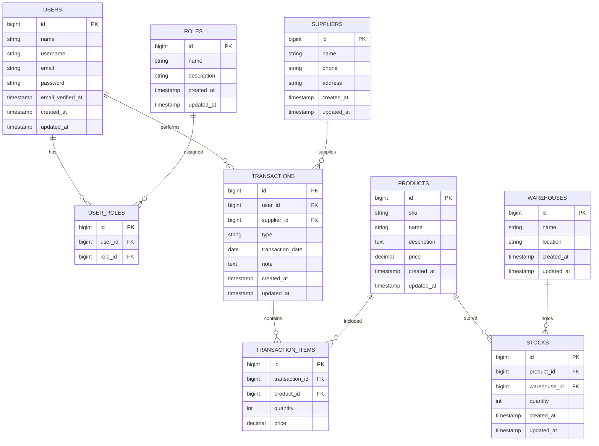

# Entity Relationship Diagram (ERD)

## Inventory Management System

## Table Descriptions

### USERS
Menyimpan data pengguna sistem dengan role-based access control (RBAC).

### ROLES
Menyimpan data role/peran pengguna:
- **Admin**: Full access to all features and settings
- **Staff**: Manage products, suppliers, and create transactions
- **Owner**: Read-only access to reports and summary

### USER_ROLES
Pivot table untuk relasi many-to-many antara users dan roles.

### PRODUCTS
Menyimpan data produk dengan SKU unique identifier.

### SUPPLIERS
Menyimpan data pemasok/supplier produk.

### WAREHOUSES
Menyimpan data gudang penyimpanan produk.

### STOCKS
Pivot table untuk menyimpan stok produk di setiap gudang dengan constraint unique (product_id, warehouse_id).

### TRANSACTIONS
Menyimpan transaksi inventory dengan tipe:
- **IN**: Transaksi masuk (pembelian dari supplier)
- **OUT**: Transaksi keluar (penjualan/pengeluaran)
- **ADJUST**: Penyesuaian stok (stock opname, koreksi)

### TRANSACTION_ITEMS
Menyimpan detail item dari setiap transaksi.

## Relationships

| From | To | Type | Description |
|------|-----|------|-------------|
| USERS | USER_ROLES | One-to-Many | User memiliki satu atau lebih role |
| ROLES | USER_ROLES | One-to-Many | Role dapat dimiliki oleh banyak user |
| USERS | TRANSACTIONS | One-to-Many | User melakukan transaksi |
| SUPPLIERS | TRANSACTIONS | One-to-Many | Supplier terkait dengan transaksi IN |
| TRANSACTIONS | TRANSACTION_ITEMS | One-to-Many | Transaksi memiliki banyak item |
| PRODUCTS | TRANSACTION_ITEMS | One-to-Many | Produk dapat muncul di banyak item transaksi |
| PRODUCTS | STOCKS | One-to-Many | Produk disimpan di berbagai gudang |
| WAREHOUSES | STOCKS | One-to-Many | Gudang menyimpan berbagai produk |

## Business Rules

1. **Stock Management**
   - Setiap produk dapat disimpan di multiple gudang
   - Unique constraint pada (product_id, warehouse_id) untuk menghindari duplikasi
   - Quantity dapat negatif untuk tracking (akan divalidasi di aplikasi)

2. **Transaction Flow**
   - Transaksi IN: Menambah stok (dengan supplier)
   - Transaksi OUT: Mengurangi stok (tanpa supplier)
   - Transaksi ADJUST: Koreksi stok (tanpa supplier)

3. **User Access Control**
   - User dapat memiliki multiple roles
   - Authorization berbasis role untuk setiap endpoint API

4. **Data Integrity**
   - Cascade delete pada user_roles, stocks, transaction_items
   - Null on delete untuk supplier_id pada transactions
